# image-preprocessing-techniques
Image pre-processing techniques from first principles. This includes:
- Affine deformations
- Sampling techniques
- Contrast and intensity functions
- Filters
- Frequency domain techniques

## Report
 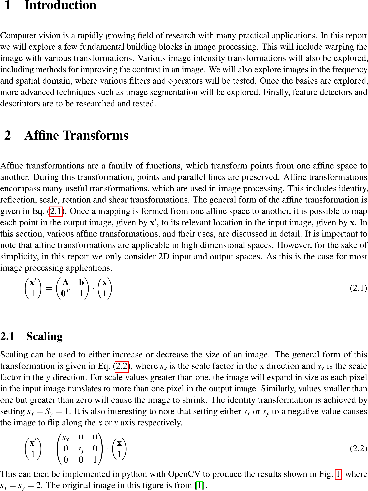
 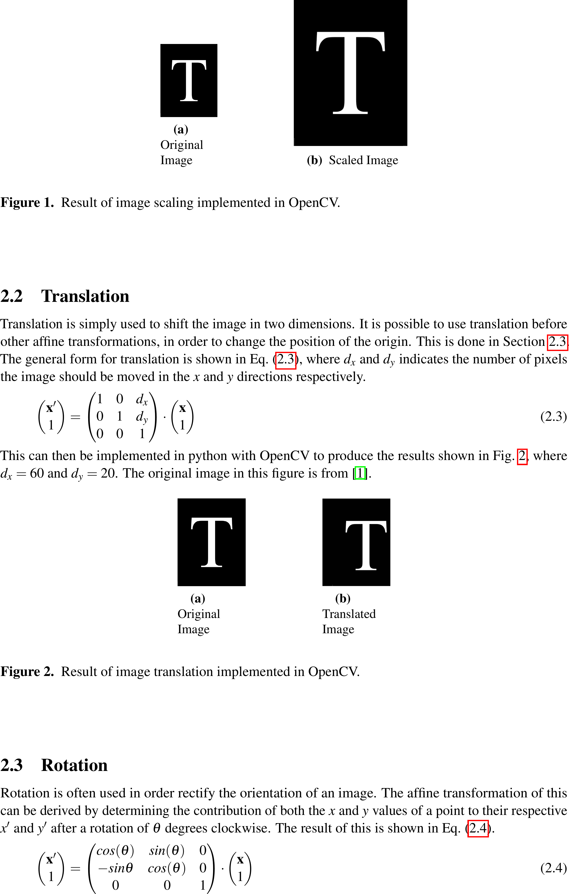
 
 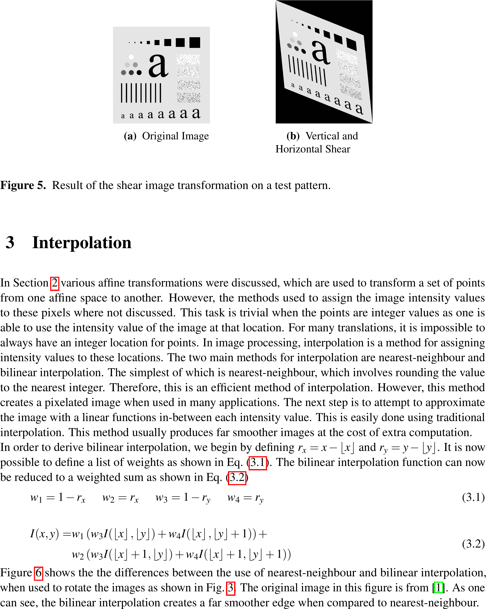
 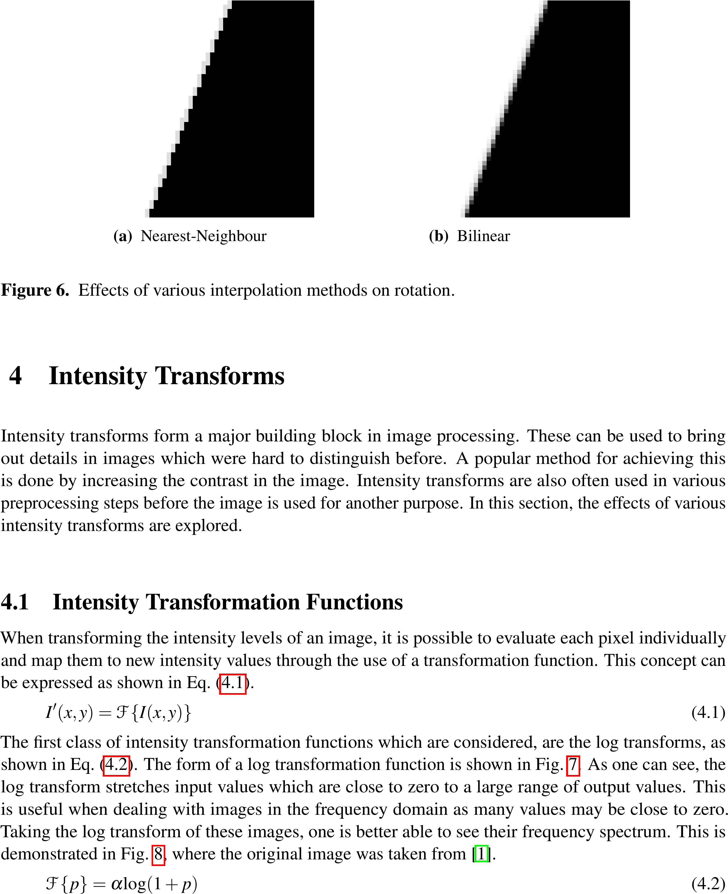
 
 
 
 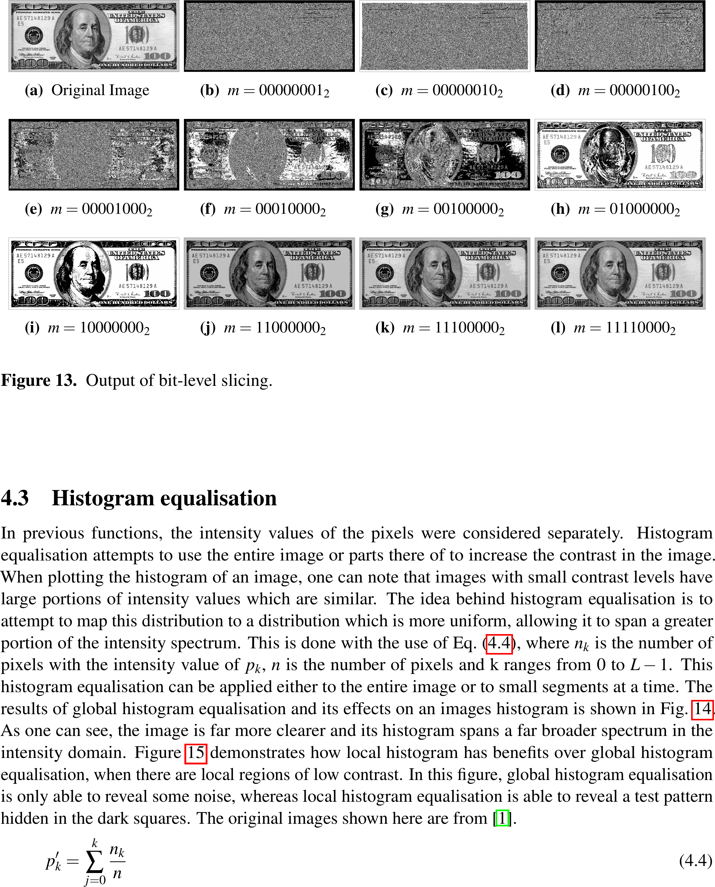
 
 
 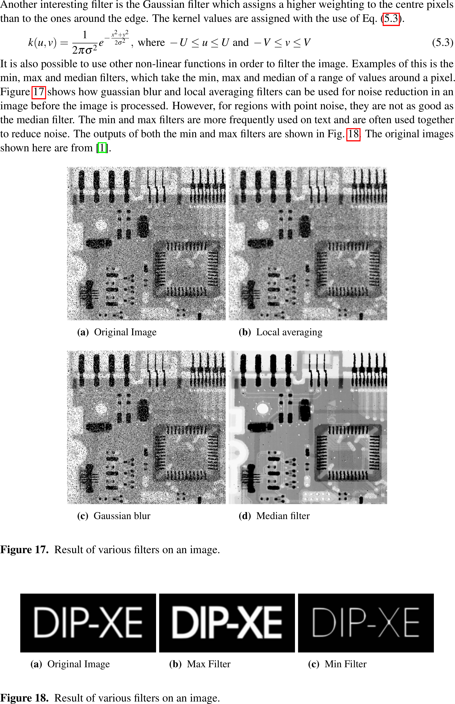
 
 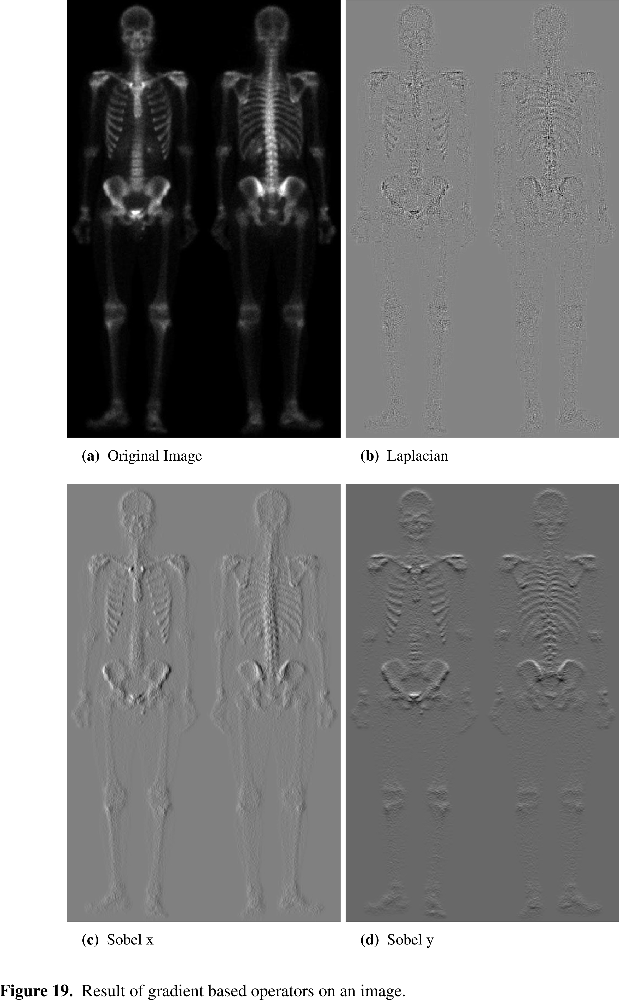
 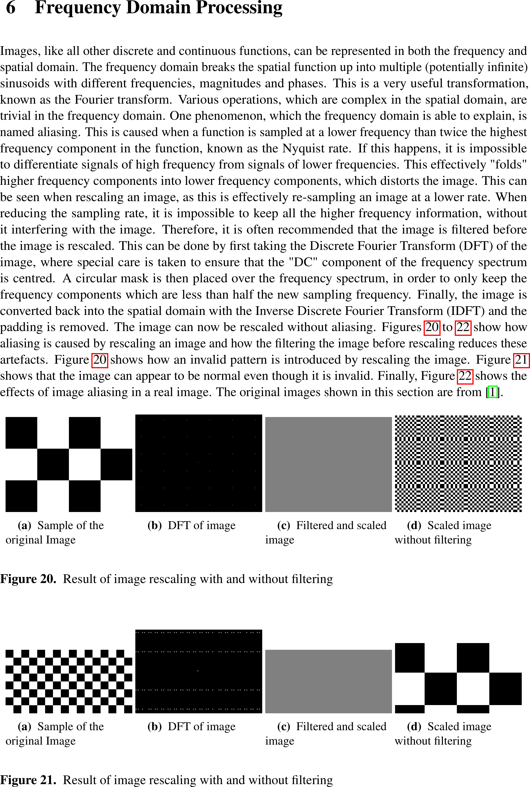
 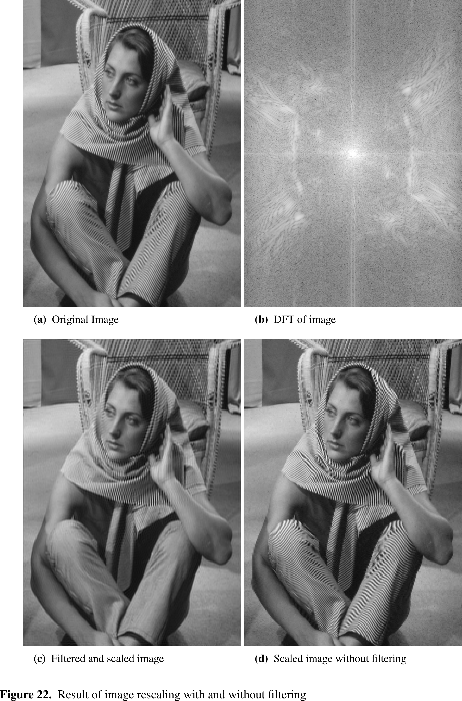
 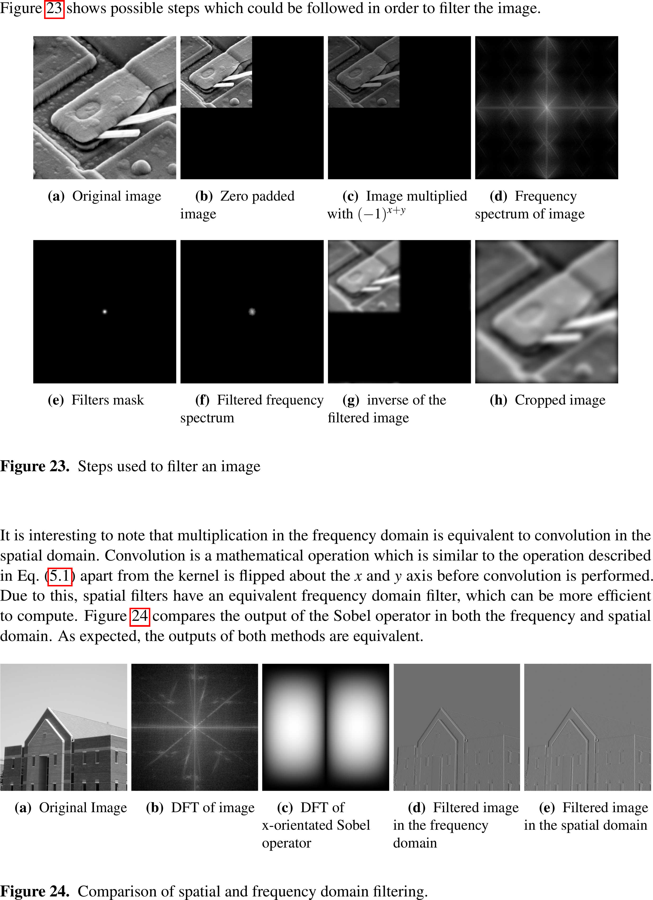
 
 
 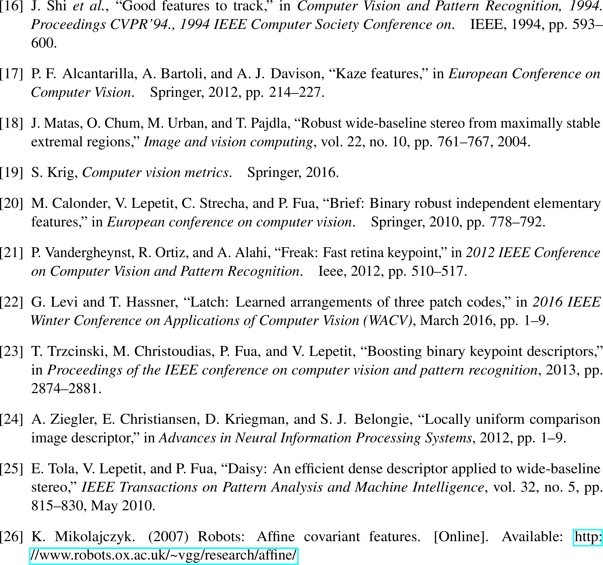
